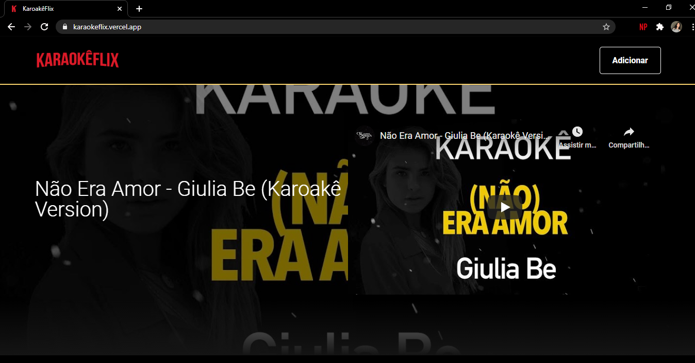

<h1 align='center'>KaraokêFlix - Imersão React</h1>

<h3 align="center">Descrição:</h3>

    Criação do projeto na Imersão React da Alura!  
    Reuni vídeos de Karaokê do YouTube, para que vocês consigam encontrar suas músicas preferidas para cantar e
    se divertir. Pode-se notar que o projeto é baseado na interface da Netflix, possui divisão das músicas por
    categorias, há um espaço para realizar a busca por nome e também tem um local para você conseguir cadastrar
    os vídeos que não encontrou mas gostaria que existisse em nossa plataforma :)

<h3>Tecnologias utilizadas 🚀</h3>
<ul>
    <li><a href="https://reactjs.org/" target="_blank">React</a></li>
    <li><a href="https://reactrouter.com/" target="_blank">React Route</a></li>
    <li><a href="https://react-slick.neostack.com/" target="_blank">React Slick</a></li>
    <li><a href="https://github.com/typicode/json-server" target="_blank">JSON Server</a></li>
</ul>

<h3 align="center">Quer criar o seu?</h3>

    # Clone esse repositório
    $ git clone https://github.com/juuliana/KaraokeFlix.git
    
    # Instalar dependências
    $ npm install
    
    # Executar
    $ npm start
    

<h2 align='center'>Criado por:</h2>

    

